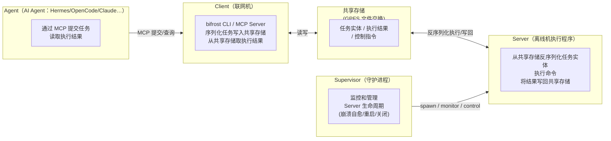
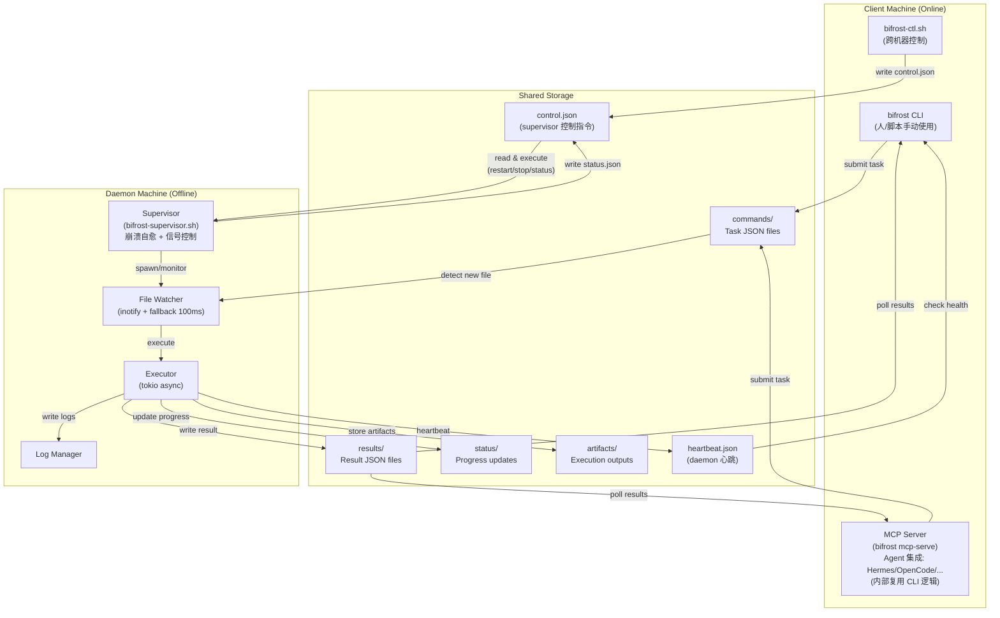
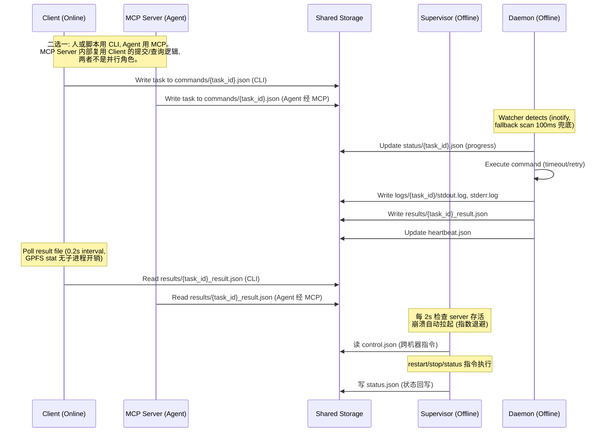

# 🌉 Bifrost - Offline Machine Command Execution Framework


[](https://github.com/peterlau123/bifrost/actions)

<p align="center">
  
</p>

Bifrost is a Rust-based framework for executing commands on offline/air-gapped machines through shared storage communication. It enables networked client machines to submit tasks and offline daemon machines to execute them, with results synchronized via portable storage.

## 目录

- [Overview](#overview)
  - [Problem Solved](#problem-solved)
  - [Key Features](#key-features)
- [Architecture](#architecture)
- [Workflow](#workflow)
- [Directory Structure](#directory-structure)
- [Environment Requirements](#environment-requirements)
  - [Client Machine (Online)](#client-machine-online)
  - [Daemon Machine (Offline)](#daemon-machine-offline)
  - [Container Execution (Optional)](#container-execution-optional)
- [Installation](#installation)
  - [Build](#build)
  - [Deploy Client (Online Machine)](#deploy-client-online-machine)
  - [Deploy Daemon (Offline Machine)](#deploy-daemon-offline-machine)
- [Configuration](#configuration)
  - [Client Configuration](#client-configuration)
  - [Daemon Configuration](#daemon-configuration)
- [Usage](#usage)
- [部署全景与发布更新流程](#-部署全景与发布更新流程)
- [Supervisor 守护进程部署](#-supervisor-守护进程部署)
- [运维实践（APMM UT 场景）](docs/ops-practice.md)
  - [Submit Tasks](#submit-tasks)
  - [Check Status](#check-status)
  - [Retrieve Results](#retrieve-results)
  - [Read Artifacts](#read-artifacts)
  - [Health Check](#health-check)
  - [Daemon Operations](#daemon-operations)
- [MCP Server (Agent Integration)](#mcp-server-agent-integration)
  - [Quick Start](#quick-start-3-steps)
  - [Agent Configurations](#agent-configurations)
  - [MCP Tools](#mcp-tools)
  - [Standard Call Sequence](#standard-call-sequence)
  - [Verification](#verification)
  - [Troubleshooting](#mcp-troubleshooting)
- [Pytest Integration](#pytest-integration)
  - [Basic Usage](#basic-usage)
  - [Pytest in Container (Offline Machine)](#pytest-in-container-offline-machine)
  - [Pytest Prerequisites](#pytest-prerequisites-offline-machine)
- [Task Types](#task-types)
- [Task Priority](#task-priority)
- [Security Features](#security-features)
  - [Command Injection Prevention](#command-injection-prevention)
  - [Path Traversal Protection](#path-traversal-protection)
- [Development](#development)
  - [Running Tests](#running-tests)
  - [Project Structure](#project-structure)
- [Documentation](#documentation)
- [Troubleshooting](#troubleshooting)
- [License](#license)
- [Status](#status)

---

## 🌉 Overview

### Problem Solved

When dealing with air-gapped machines (no network access), traditional remote execution tools like SSH, RPC, or REST APIs don't work. Bifrost solves this by using **shared storage as a communication channel**:

- **Client** (networked machine) writes tasks to `commands/` directory
- **Daemon** (offline machine) watches for new tasks and executes them
- **Results** are written back to `results/` directory
- Synchronization via GPFS shared storage

### Key Features

- **Bridge abstraction** - Transport-agnostic communication: shared storage (GPFS/NFS) **and SSH** implemented
- **Unified settings** - ~/.bifrost/settings.json, init via CLI
- **Air-gapped operation** - Complete separation between client and server
- **Security hardened** - Command injection prevention, path traversal protection
- **High performance** - inotify file watching + fallback scan (100ms), tokio async execution, e2e overhead ~4-6%
- **Multiple task types** - Shell commands, pytest tests, custom adapters
- **Parallel jobs** - `--parallel` submits all tasks concurrently (daemon max_concurrent)
- **Priority scheduling** - Tasks sorted by priority (0-255)
- **Timeout management** - Configurable timeouts with automatic retry
- **systemd integration** - Production-ready server deployment
- **Supervisor daemon** - 崩溃自愈、信号控制、跨机器控制（bifrost-supervisor.sh）
- **MCP Server** - 内置 MCP，任何 MCP Agent (Hermes/OpenCode/Claude) 直接接入
- **Health monitoring** - Heartbeat-based server health checks

## 🏗️ Architecture

### 简略图（四组件交互）



### 详细图（含共享存储与内部组件）



## 🔄 Workflow



## 📁 Directory Structure

```
/shared/storage/
├── commands/              # Client writes, daemon reads
│   └── 20260704_103000_{uuid}.json
├── results/               # Daemon writes, client reads
│   └── {uuid}_result.json
├── status/                # Daemon writes progress updates
│   └── {uuid}.json
├── artifacts/             # Execution artifacts
│   └── {uuid}_report.json
├── logs/                  # Detailed execution logs
│   └── {uuid}/
│       ├── stdout.log
│       ├── stderr.log
│       └── metadata.json
├── heartbeat.json         # Daemon health status
├── control.json           # 跨机器控制指令 (bifrost-ctl.sh 写, supervisor 读)
├── status.json            # supervisor 状态回写 (bifrost-ctl.sh status 读)
├── supervisor.pid         # supervisor 进程 PID
├── server.pid             # daemon server 进程 PID
└── server.log             # supervisor + server 日志
```

## 环境要求

### 源机器（联网机器，Client 端）

| 需求 | 版本 | 说明 |
|------|------|------|
| **Rust** | 1.70+ | 编译环境，只需编译一次 |
| **共享存储** | - | GPFS / NFS / Lustre 等 POSIX 共享文件系统，与 目标机器 共用 |

### 目标机器（离线机器，Daemon 端）

| 需求 | 版本 | 说明 |
|------|------|------|
| **bifrost 二进制** | - | 单一二进制，零依赖 |
| **systemd** | - | 可选，推荐生产使用 |
| **共享存储** | - | 与 源机器 挂载同一共享目录（GPFS / NFS / Lustre 等） |
| **Python** | 3.10+ | 可选，执行 pytest 任务时需要 |
| **pytest** | 7.x | 可选，执行 pytest 任务时需要 |
| **pytest-json-report** | - | Plugin for structured results |

### Container Execution (Optional)

通过容器在 目标机器 上执行 pytest：

```yaml
# adapters/docker_pytest.yaml
name: docker_pytest
description: Execute pytest in Docker container
command_template: "docker run --rm -v {working_dir}:/work python:3.10 pytest /work/{path} --json-report"
timeout: 600
artifacts:
  - report.json
env_vars:
  PYTEST_JSON_REPORT_FILE: "/work/report.json"
```

## 🛠️ Installation

### Build

编译环境需要 Rust 1.70+。如果没有 Rust 工具链，可以在任意有 Rust 的机器上编译，然后分发单一二进制文件（静态编译，无运行时依赖）。

```bash
# 克隆仓库
git clone http://10.20.30.25:8080/agent/bifrost.git
cd bifrost

# 编译 release 版本（约 8MB 单一二进制）
cargo build --release

# 确认编译产物
ls -lh target/release/bifrost
```

> **交叉编译：** 如果目标架构不同（如 x86_64 编译、aarch64 部署）：
> `cargo build --release --target aarch64-unknown-linux-gnu`

---

### 部署到 源机器（联网机器，Client 端）

源机器 机器负责下发命令和查询结果，只需要 CLI 二进制和配置文件。

```bash
# 1. 复制二进制
sudo cp target/release/bifrost /usr/local/bin/

# 2. 初始化配置（生成 ~/.bifrost/settings.json）
bifrost server --init

# 3. 编辑配置，指定共享存储路径
vim ~/.bifrost/settings.json
```

```json
{
  "shared_storage": "/mnt/gpfs/bifrost",
  "database": "/mnt/gpfs/bifrost/bifrost.db",
  "client": {
    "poll_interval": "2s",
    "heartbeat_timeout": "180s"
  }
}
```

**验证 Client：**

```bash
# 查看帮助
bifrost client submit --help

# 提交一个简单任务验证连通性（需 目标机器 daemon 已运行）
bifrost client submit --command "hostname" --timeout 30
# 记下返回的 TASK_ID
bifrost client status <TASK_ID>
```

---

### 部署到 目标机器（离线机器，Daemon 端）

目标机器 机器网络隔离，通过共享存储接收命令并返回结果。

两台机器挂载同一共享目录（当前使用 GPFS，也支持 NFS、Lustre 等 POSIX 文件系统），编译好的二进制可以直接被 目标机器 访问。

```bash
# ---- 源机器 端：编译后写入 GPFS 共享目录 ----
cp target/release/bifrost /mnt/gpfs/bifrost/bin/

# ---- 目标机器 端：从共享存储安装 ----
# GPFS 已挂载在 /mnt/gpfs，直接访问
sudo cp /mnt/gpfs/bifrost/bin/bifrost /usr/local/bin/
sudo chmod +x /usr/local/bin/bifrost

# 初始化配置
mkdir -p ~/.bifrost
bifrost server --init
```

#### 目标机器 配置 shared storage

```bash
vim ~/.bifrost/settings.json
```

```json
{
  "shared_storage": "/mnt/gpfs/bifrost",
  "daemon": {
    "poll_interval": "500ms",
    "task_timeout": "300s",
    "max_retries": 3,
    "heartbeat_interval": "60s",
    "max_concurrent": 10,
    "working_dir": "/tmp/bifrost/work"
  }
}
```

> **重要：** 源机器 和 目标机器 的 `shared_storage` 必须指向同一物理目录。

#### 注册 systemd 服务（推荐生产使用）

```bash
# 安装服务文件（项目根目录有 bifrost.service）
sudo cp bifrost.service /etc/systemd/system/
sudo systemctl daemon-reload
sudo systemctl enable bifrost
sudo systemctl start bifrost

# 查看状态
sudo systemctl status bifrost

# 查看实时日志
journalctl -u bifrost -f
```

#### 手动启动守护进程（调试用）

```bash
# 前台运行，按 Ctrl+C 停止
bifrost server

# 指定配置文件
bifrost server --config ~/.bifrost/settings.json

# 验证心跳文件已生成
ls -la /mnt/gpfs/bifrost/heartbeat.json
```

---

### 端到端验证部署

```bash
# 目标机器 端：确认 daemon 运行且心跳正常
ls -la /mnt/gpfs/bifrost/heartbeat.json           # 文件应存在，60s 内更新
cat /mnt/gpfs/bifrost/heartbeat.json | head -5    # 显示 daemon 状态

# 源机器 端：端到端测试
# 注意：命令不经 shell 解释（防注入），&& / | / > 等 shell 语法需用 sh -c 包裹
bifrost client submit \
  --command "sh -c 'echo \"bifrost deployment ok\"; nvidia-smi -L | head -3'" \
  --timeout 30

# 5-10 秒后查询结果
bifrost client status <TASK_ID>
# 预期输出应为 "Completed"，消息包含 "bifrost deployment ok"
```

## ⚙️ Configuration

### Settings File (`~/.bifrost/settings.json`)

```bash
bifrost server --init  # generate default settings
```

```json
{
  "shared_storage": "/tmp/bifrost",
  "client": {},
  "daemon": {}
}
```

| Field | Client | Server | Description |
|-------|--------|--------|-------------|
| shared_storage | Yes | Yes | Root directory for commands/results/logs |
| transport | Yes | -- | Bridge type: `"shared"` (default) or `"ssh"` |
| ssh | Yes | -- | SSH bridge config (host/remote_dir/...) — required when transport=ssh |
| client.* | Yes | -- | Poll interval, heartbeat timeout |
| daemon.* | -- | Yes | Concurrency, timeout, retry, working dir |

### SSH Bridge (transport = "ssh")

当 Client 与目标机**没有共享文件系统**、但可通过 SSH 访问时，用 SSH 作为传输层：Client 通过 ssh 读写目标机的 `commands/ results/ status/ artifacts/` 目录，目标机上的 daemon 依旧用本地 Protocol 消费任务——两端目录语义完全一致，daemon 无需改动。

```json
{
  "shared_storage": "/tmp/bifrost",            // daemon 侧仍用它定位本地目录
  "transport": "ssh",
  "ssh": {
    "host": "target-machine.example.com",      // 必填
    "user": "bifrost",                          // 可选，默认当前用户
    "remote_dir": "/gpfs/bifrost",              // 必填：目标机上充当 shared_storage 的目录
    "port": 22,                                 // 可选，默认 22
    "connect_timeout": "10s"                    // 可选，每次 ssh 连接超时（默认 10s）
  },
  "client": {},
  "daemon": {}
}
```

要求：本机可 `ssh <host>` 免密登录（`BatchMode=yes`）。文件内容经 ssh stdin 传输（`cat >` + 原子 `mv`），路径经 shell 转义，无注入风险。

## 🚀 Usage

### Submit Tasks

```bash
# 提交任意 shell 命令（以 pytest 开头自动识别为 pytest 任务）
bifrost client submit --command "pytest tests/unit/ -v" --timeout 600
bifrost client submit --command "python script.py --input data.csv" --timeout 300 --priority 10

# 指定工作目录
bifrost client submit --command "make build" --working-dir /workspace/project --timeout 1200

# 提交 YAML Job（多步骤顺序执行）
bifrost client submit --job examples/quick_start.yaml
```

### Check Status

```bash
# 查询任务状态（位置参数，无需 --task-id）
bifrost client status <TASK_ID>

# 输出
Task ID: abc123-def456
Status: Completed
Message: Task completed in 45s
```

### Cancel Task

```bash
bifrost client cancel <TASK_ID>
```

### Clean Up Old Tasks (prevent storage growth)

Long-running deployments accumulate files in `commands/ results/ status/ logs/ artifacts/`. Clean removes all files of **finished tasks** (those with a result file) older than N days:

```bash
# Preview what would be removed (safe, no deletion)
bifrost client clean --older-than 7 --dry-run

# Actually remove finished tasks' files older than 7 days
bifrost client clean --older-than 7

# Target a specific storage directory
bifrost client clean --storage /gpfs/gcsp/liuxin/bifrost_test --older-than 30
```

**Safety guarantees:**
- Only tasks **with a result file** (terminal state) are touched — pending/running tasks are never candidates
- `heartbeat.json` and `settings.json` are **never** removed
- `--dry-run` previews before any deletion; `--older-than` defaults to 7 days

**Example output:**
```
$ bifrost client clean --older-than 7 --dry-run
  would remove aaaaaaaa-aaaa-aaaa-aaaa-aaaaaaaaaaaa (5 files)
  would remove bbbbbbbb-bbbb-bbbb-bbbb-bbbbbbbbbbbb (2 files)
[dry-run] 2 finished tasks, 7 files would be removed (older than 7 days)

$ bifrost client clean --older-than 7
Removed 7 files from 2 finished tasks (older than 7 days)
```

### Pytest in Container (Offline Machine)

To run pytest in a container on the offline machine:

1. **Create Docker adapter**:
```yaml
# /etc/bifrost/adapters/docker_pytest.yaml
name: docker_pytest
command_template: "docker run --rm -v {working_dir}:/app -w /app python:3.10-slim pytest {path} --json-report --json-report-file=report.json"
timeout: 600
artifacts:
  - report.json
```

2. **Submit task with adapter**:
```bash
bifrost client submit \
  --command "docker run --rm -v /workspace/myproject:/app -w /app python:3.10-slim pytest tests/unit/ --json-report --json-report-file=report.json" \
  --working-dir /workspace/myproject \
  --timeout 600
```

### Pytest Prerequisites (Offline Machine)

Install on offline machine or in container:

```bash
pip install pytest pytest-json-report pytest-cov
```

---

## 🗺️ 部署全景与发布更新流程

> 一个 bifrost 二进制，跑 4 类角色：**Client CLI**、**Daemon Server**、**MCP Server**、**Supervisor**。
> 发布新版本时，不同角色的更新方式不同，下面统一交代。

### 部署矩阵

| 角色 | 跑在哪 | 谁启动 | 配置来源 | 是否需要"安装" |
|---|---|---|---|---|
| **Client CLI** | 联网机（本机）| 手动/脚本 | `BIFROST_CONFIG` 或 `~/.bifrost/settings.json` | 仅二进制在 GPFS，无需安装 |
| **Daemon Server** | 离线机（H20）| Supervisor 或 systemd | `-c <config>` 或 `~/.bifrost/settings.json` | 二进制 + working_dir |
| **MCP Server** | 联网机（Agent 侧）| Agent（Hermes/OpenCode…）自动拉起 | `BIFROST_CONFIG` 环境变量 | 无（Agent 配置指向二进制）|
| **Supervisor** | 离线机（H20）| `bifrost-supervisor.sh start` 或 crontab @reboot | 内置路径常量 | 脚本 + 二进制 |

### 发布流程（新版本）

```bash
# 1. 在联网机编译
cd bifrost
cargo build --release

# 2. 二进制产物（GPFS 共享存储，两端都能访问）
ls -lh target/release/bifrost
#    -> /gpfs/gcsp/liuxin/bifrost/target/release/bifrost
```

### 发布后各角色更新方式

| 角色 | 需要更新吗 | 怎么更新 | 说明 |
|---|---|---|---|
| **Client CLI** | ✅ | 无需操作 | 每次调用都重新 exec 二进制，自动用新版 |
| **MCP Server** | ✅ | **必须 kill 旧 mcp-serve 进程** | 常驻进程，改 binary 后 Agent 不会自动重启；kill 后下次调用自动拉起新版（⚠️ 最常见遗漏点）|
| **Daemon Server** | ✅ | `./bifrost-ctl.sh restart`（本机）或 `kill -HUP <supervisor_pid>`（H20）| Supervisor 负责 kill 旧 + 起新 |
| **Supervisor** | ⚠️ 仅当脚本本身改了 | 重启 supervisor：`./bifrost-supervisor.sh restart` | 脚本更新才需要，binary 更新不需要动 supervisor |

### 更新检查清单

```
编译新 binary 后：
1. ✅ Client CLI    - 自动生效（无状态）
2. ⚠️ MCP Server   - 必须 kill 旧 mcp-serve（Hermes: pkill -f "bifrost mcp-serve"）
3. 🔄 Daemon Server - ./bifrost-ctl.sh restart（跨机器，无需 SSH）
4. ⏹️ Supervisor    - 二进制更新无需动；脚本更新才 restart
```

### 跨机器控制（无需 SSH）

```bash
# 本机运行，通过 GPFS control.json 控制 H20 上的 server
./bifrost-ctl.sh restart    # 重启 H20 daemon（编译后必做）
./bifrost-ctl.sh status     # 查询状态（回写 status.json）
./bifrost-ctl.sh stop       # 关闭
```

> 详细运维记录见 [docs/ops-practice.md](docs/ops-practice.md)。

---

## 🛡️ Supervisor 守护进程部署

Supervisor 是跑在**离线机（Daemon 端）**的守护脚本，管理 bifrost server 生命周期：
崩溃自愈、信号控制、跨机器控制（通过 GPFS 控制文件）。推荐生产使用，替代手动启停。

### 脚本一览

| 脚本 | 位置 | 用途 |
|---|---|---|
| `bifrost-supervisor.sh` | 离线机（H20）| 守护进程：server 生命周期管理 |
| `bifrost-ctl.sh` | 联网机（Client 端）| 跨机器控制（restart/stop/status）|
| `install-supervisor-cron.sh` | 离线机（H20）| crontab @reboot 开机自启 |
| `restart_server.sh` | 离线机（H20）| 轻量版一键重启（无 supervisor 时用）|

### 部署（离线机 H20，一次性）

```bash
cd /gpfs/gcsp/liuxin/bifrost

# 1. 启动 supervisor（后台常驻，nohup，SSH 断开不影响）
./bifrost-supervisor.sh start
#   输出: supervisor pid: <PID>  (log: .../server.log)

# 2. 可选: 开机自启（系统重启后自动拉起）
./install-supervisor-cron.sh

# 3. 验证
./bifrost-supervisor.sh status
#    supervisor:  running (pid=<PID>)
#    bifrost server: running (pid=<PID>)
```

### 跨机器控制（联网机，无需 SSH）

```bash
# 通过 GPFS control.json 给 H20 supervisor 发指令（2s 内生效）
./bifrost-ctl.sh restart    # 重启 H20 daemon（编译新 binary 后必做）
./bifrost-ctl.sh status     # 查询状态（supervisor 回写 status.json）
./bifrost-ctl.sh stop       # 关闭 server + supervisor
```

### 本地信号控制（H20 上，可选）

```bash
kill -HUP  <supervisor_pid>   # 重启 bifrost server
kill -TERM <supervisor_pid>   # 关闭 server + supervisor
kill -USR1 <supervisor_pid>   # 打印状态
```

### 健壮性特性

| 特性 | 机制 |
|---|---|
| 长期常驻 | nohup 后台，SSH 断开不影响 |
| 崩溃自愈 | 2s 健康检查 + 指数退避重试（上限 60s）|
| 单实例锁 | flock 防重复启动 |
| 日志轮转 | 5MB 自动归档，保留 3 份 |
| 控制容错 | 坏 JSON/未知指令忽略 |
| 优雅停止 | TERM 等 5s，超时 SIGKILL |
| **孤儿进程防护** | setsid 启动 daemon（独立进程组）+ 进程组 kill + 启动前清理残留任务 |

### 卸载

```bash
./bifrost-supervisor.sh stop
# 如安装了自启, 移除 crontab 行:
# crontab -e 删除含 bifrost-supervisor 的行
```

---

## 🤖 MCP Server (Agent Integration)

Bifrost ships a **built-in MCP (Model Context Protocol) server** that exposes task submission as structured tools over stdio. **Any MCP-capable agent** — Hermes, OpenCode, Claude Code, Cline, Cursor, Codex, or any generic coding agent — can connect and submit tasks to the offline daemon without writing file-exchange glue code.

```
┌─────────────────────────────────────────┐
│ 任意 MCP Agent (Hermes/OpenCode/Claude…) │
│   └─ stdio MCP ── bifrost mcp-serve    │  ← 联网侧 (client 机器)
├─────────────────────────────────────────┤
│        GPFS 共享存储 (shared_storage)    │
│   commands/  results/  status/  logs/   │
├─────────────────────────────────────────┤
│        bifrost daemon (H20, 离线)        │
│   inotify 监控 → 并发执行 → 写回结果     │
└─────────────────────────────────────────┘
```

The MCP server is **stateless**: every tool call reads/writes GPFS directly. Multiple agents can connect simultaneously (one process instance per connection) without conflicts.

> 完整接入指南（含全部 Agent 配置示例）见 [MCP.md](MCP.md)。

### Quick Start (3 steps)

**1. Build the binary** (on the online/client machine):

```bash
cargo build --release        # target/release/bifrost (3.0M)
```

**2. Prepare a settings file** — point `shared_storage` at the same GPFS exchange directory used by the offline daemon:

```json
{
  "shared_storage": "/gpfs/gcsp/liuxin/bifrost",
  "client": { "poll_interval": "2s", "heartbeat_timeout": "180s" },
  "daemon": { "task_timeout": "300s", "heartbeat_interval": "60s", "max_concurrent": 10 }
}
```

**3. Register in your agent** — the universal config is:

```
command: /path/to/target/release/bifrost
args:    ["mcp-serve"]
env:     BIFROST_CONFIG=/path/to/settings.json   (optional; falls back to ~/.bifrost/settings.json)
```

Config resolution order: **`BIFROST_CONFIG` env > `-c` flag > `~/.bifrost/settings.json` > defaults**.

### Agent Configurations

**Hermes**

```bash
hermes mcp add bifrost --command /path/to/target/release/bifrost --args mcp-serve
hermes mcp test bifrost
```

**OpenCode** — `opencode.json`:

```json
{
  "mcp": {
    "bifrost": {
      "type": "stdio",
      "command": "/path/to/target/release/bifrost",
      "args": ["mcp-serve"],
      "env": { "BIFROST_CONFIG": "/path/to/settings.json" }
    }
  }
}
```

**Claude Code**

```bash
claude mcp add bifrost --env BIFROST_CONFIG=/path/to/settings.json -- /path/to/target/release/bifrost mcp-serve
```

or project-level `.mcp.json`:

```json
{
  "mcpServers": {
    "bifrost": {
      "command": "/path/to/target/release/bifrost",
      "args": ["mcp-serve"],
      "env": { "BIFROST_CONFIG": "/path/to/settings.json" }
    }
  }
}
```

**Cline / Cursor / generic coding agents** — same `mcpServers` JSON shape with `command` + `args` + `env` (see [MCP.md](MCP.md) for screenshots-level detail).

### MCP Tools

| Tool | Purpose | When to call |
|------|---------|-------------|
| `bifrost_health` | Check offline daemon heartbeat freshness | **Always before submit**: if `alive=false`, tasks would be written but never consumed (inotify only watches new files) |
| `bifrost_submit` | Submit a command task, returns `task_id` | Args: `command` (required), `timeout`, `priority`, `working_dir` |
| `bifrost_status` | Query task status | Poll with `task_id` until terminal state |
| `bifrost_result` | Fetch full result | After terminal state: stdout/stderr/exit_code/duration_ms |

### Standard Call Sequence

```
1. bifrost_health        → confirm alive=true (daemon online)
2. bifrost_submit        → {"command": "sh -c 'echo hi'", "timeout": 60} → task_id
3. bifrost_status        → poll: Pending → Running → Completed/Failed/Timeout
4. bifrost_result        → get stdout, exit code, duration
```

**Important rules:**
- Complex commands **must be wrapped in `sh -c '...'`** (injection-prevention design; `>`, `&&`, `$VAR`, `&` need a shell)
- Check `bifrost_health` before submitting — a not-ready daemon silently drops tasks
- Daemon executes concurrently up to `max_concurrent` (default 10); burst submits are fine

### Verification

```bash
# Via Hermes
hermes mcp test bifrost

# Manual JSON-RPC handshake (any agent-agnostic check)
echo '{"jsonrpc":"2.0","id":1,"method":"initialize","params":{"protocolVersion":"2025-06-18","capabilities":{},"clientInfo":{"name":"inspector","version":"1.0"}}}' \
  | bifrost mcp-serve | head -3

# Full E2E: health → submit → status → result
python3 /gpfs/gcsp/liuxin/bifrost_test/test_mcp_e2e.py
```

### MCP Troubleshooting

| Problem | Cause | Fix |
|---------|-------|-----|
| Connection closed on add | shared_storage path not writable/missing | Fix `shared_storage` in settings.json |
| `alive: false` | daemon not running or heartbeat stale | Start `bifrost server -c <cfg>` on H20, wait 2s |
| Task stuck Pending | daemon not consuming (inotify skips existing files) | Check health before submit; ensure server is up |
| submit error | command format issue | Wrap complex commands in `sh -c '...'` |
| Multi-agent usage | — (no conflict, file-based) | No extra config needed |

## Task Types

| Type | Description | Use Case |
|------|-------------|----------|
| `shell` | Shell command execution | Build scripts, data processing |
| `pytest` | Python test execution | Unit tests, integration tests |
| `custom` | Adapter-based execution | Docker, specialized tools |

## Task Priority

Priority ranges from 0 to 255:

| Range | Priority | Example |
|-------|----------|---------|
| 0-10 | High | Critical fixes, urgent tests |
| 11-50 | Normal | Regular tests, builds |
| 51-100 | Low | Background tasks, cleanup |
| 101-255 | Lowest | Maintenance, logs |

## 🛡️ Security Features

### Command Injection Prevention

Bifrost uses `shell-words::split()` to parse commands safely, avoiding shell interpolation:

```rust
// Safe: Direct process spawn without shell
let args = shell_words::split(&command)?;
Command::new(&args[0]).args(&args[1..]);
```

> **实测注意**：由于命令不经 shell 解释，`&&`、`||`、管道 `|`、重定向 `>`、通配符 `*` 等 **shell 语法不会生效**，整条命令会被当作单个可执行文件的参数。需要 shell 特性时，请显式用 `sh -c` 包裹：

```bash
# ✅ 正确：显式调用 shell 解释多命令/管道/重定向
bifrost client submit --command "sh -c 'cd /workspace && make build 2>&1 | tee build.log'"

# ❌ 错误：&& 和 | 会被原样当作 echo 的参数输出，不会执行
bifrost client submit --command "echo hello && nvidia-smi -L | head -3"
```

### 任务监控时机（inotify 行为）

Daemon 使用 `notify`（inotify）监听 `commands/` 目录，**只捕获启动后新出现的文件**，不会扫描启动前已存在的存量任务。因此：

- **正确姿势**：先启动 daemon，再提交任务
- **遗留任务**：daemon 启动前已写入 `commands/` 的任务文件不会被消费（也不报错），需要重新提交或在 daemon 重启后处理

### Path Traversal Protection

Artifact paths are validated with canonicalization:

```rust
// Validate: no /, \, .., or null bytes
// Canonicalize: verify path is within artifacts directory
let canonical = artifact_path.canonicalize()?;
if !canonical.starts_with(&artifacts_dir) {
    return Err("Path traversal detected");
}
```

## 🧪 Development

### Running Tests

```bash
# All tests
cargo test --all

# Unit tests only
cargo test --lib

# Integration tests
cargo test --test full_workflow_test

# Coverage (requires tarpaulin)
cargo tarpaulin --out Html
```

### End-to-End Tests (CI-equivalent)

The full e2e suite lives in `tests/e2e/` (timeout, job, concurrent, multi-GPU pytest, robustness, MCP) and runs on **GitHub Actions CI** (`.github/workflows/ci.yml`):

```bash
cargo build --release
python3 tests/e2e/run_all.py ./target/release/bifrost   # 6 suites, ~50s
```

CI also enforces `cargo fmt --check` and `cargo clippy --all-targets -- -D warnings` on every push.

### Project Structure

```
bifrost/
├── src/
│   ├── core/           # Core models, protocol, and services
│   │   ├── models.rs   # Task, TaskResult, TaskStatus
│   │   ├── bridge.rs   # Bridge transport trait
│   │   ├── protocol.rs # Shared-storage bridge impl
│   │   ├── settings.rs # ~/.bifrost/settings.json
│   │   ├── db.rs       # TODO: SQLite history
│   │   ├── error.rs    # Error types
│   │   ├── lock.rs     # File locking
│   │   └── batch_tracker.rs
│   ├── client/         # Client submission and query
│   │   ├── submit.rs   # Task submission
│   │   ├── status.rs   # Status query
│   │   ├── results.rs  # Result retrieval
│   │   └── launcher.rs # Job launcher
│   ├── daemon/         # Daemon executor and watcher
│   │   ├── watcher.rs  # File event monitoring
│   │   ├── executor.rs # Command execution
│   │   ├── heartbeat.rs# Health monitoring
│   │   └── logger.rs   # Log management
│   └── main.rs         # CLI entry point
├── tests/
│   ├── unit/           # Unit tests
│   └── integration/    # Integration tests
├── config/             # Default configurations
├── scripts/            # Deployment scripts
└── docs/               # Documentation
```

## 📚 Documentation

- [Adapter Guide](docs/adapter-guide.md) - Custom task adapters
- [Deployment Guide](docs/deployment.md) - Production deployment
- [MCP Integration Guide](MCP.md) - Universal agent integration (OpenCode / Claude Code / Cline / Cursor / Hermes)
- [Test Report](test.md) - Performance & timeout & job workflow test reports

## 🩺 Troubleshooting

### Daemon Not Detecting Tasks

1. Check shared storage path permissions
2. Verify notify library works: `strace -e inotify_wait bifrost server`
3. Check commands/ directory exists
4. **Task was submitted before daemon started** - inotify only watches files created *after* daemon startup; stale tasks in `commands/` are silently ignored. Re-submit the task or restart the daemon.

### Task Timeout

1. Increase timeout in task submission
2. Check system resources on daemon machine
3. Profile command execution time

### Heartbeat Timeout

1. Verify daemon process running: `systemctl status bifrost`
2. Check heartbeat.json permissions
3. Verify shared storage accessible

### Artifact Not Found

1. Verify command generates expected artifacts
2. Check working directory
3. Verify artifact_name doesn't contain path separators

## 📄 License

MIT License - see [LICENSE](LICENSE) file.

## 📌 Status

Bifrost v0.1.0 is released. Core functionality is stable and tested. Future enhancements:

- Web UI monitoring dashboard
- Distributed execution (multiple daemons)
- Task dependency graph (DAG scheduling)
- AI-based task scheduling optimization