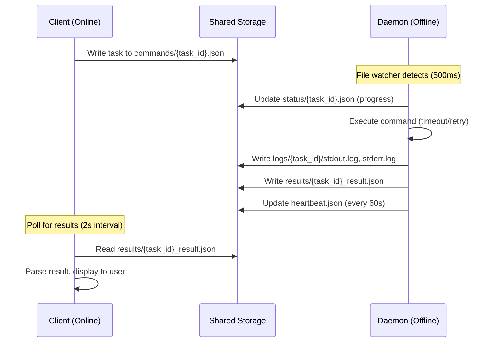

# Bifrost - Offline Machine Command Execution Framework

Bifrost is a Rust-based framework for executing commands on offline/air-gapped machines through shared storage communication. It enables networked client machines to submit tasks and offline daemon machines to execute them, with results synchronized via portable storage.

## 目录

- [Overview](#overview)
  - [Problem Solved](#problem-solved)
  - [Key Features](#key-features)
- [Architecture](#architecture)
- [Workflow](#workflow)
- [Directory Structure](#directory-structure)
- [Environment Requirements](#environment-requirements)
  - [Client Machine (Online)](#client-machine-online)
  - [Daemon Machine (Offline)](#daemon-machine-offline)
  - [Container Execution (Optional)](#container-execution-optional)
- [Installation](#installation)
  - [Build](#build)
  - [Deploy Client (Online Machine)](#deploy-client-online-machine)
  - [Deploy Daemon (Offline Machine)](#deploy-daemon-offline-machine)
- [Configuration](#configuration)
  - [Client Configuration](#client-configuration)
  - [Daemon Configuration](#daemon-configuration)
- [Usage](#usage)
  - [Submit Tasks](#submit-tasks)
  - [Check Status](#check-status)
  - [Retrieve Results](#retrieve-results)
  - [Read Artifacts](#read-artifacts)
  - [Health Check](#health-check)
  - [Daemon Operations](#daemon-operations)
- [Pytest Integration](#pytest-integration)
  - [Basic Usage](#basic-usage)
  - [Pytest in Container (Offline Machine)](#pytest-in-container-offline-machine)
  - [Pytest Prerequisites](#pytest-prerequisites-offline-machine)
- [Task Types](#task-types)
- [Task Priority](#task-priority)
- [Security Features](#security-features)
  - [Command Injection Prevention](#command-injection-prevention)
  - [Path Traversal Protection](#path-traversal-protection)
- [Development](#development)
  - [Running Tests](#running-tests)
  - [Project Structure](#project-structure)
- [Documentation](#documentation)
- [Troubleshooting](#troubleshooting)
- [License](#license)
- [Status](#status)

---

## Overview

### Problem Solved

When dealing with air-gapped machines (no network access), traditional remote execution tools like SSH, RPC, or REST APIs don't work. Bifrost solves this by using **shared storage as a communication channel**:

- **Client** (networked machine) writes tasks to `commands/` directory
- **Daemon** (offline machine) watches for new tasks and executes them
- **Results** are written back to `results/` directory
- Synchronization via USB drives, network shares, or rsync

### Key Features

- **Task history with SQLite** - All tasks recorded for query
- **Structured pytest reports** - Store pytest JSON results
- **Unified settings** - ~/.bifrost/settings.json, init via CLI
- **Air-gapped operation** - Complete separation between client and daemon
- **Security hardened** - Command injection prevention, path traversal protection
- **High performance** - notify-based file watching (500ms latency), tokio async execution
- **Multiple task types** - Shell commands, pytest tests, custom adapters
- **Priority scheduling** - Tasks sorted by priority (0-255)
- **Timeout management** - Configurable timeouts with automatic retry
- **systemd integration** - Production-ready daemon deployment
- **Health monitoring** - Heartbeat-based daemon health checks

## Architecture


## Workflow



## Directory Structure

```
/shared/storage/
├── commands/              # Client writes, daemon reads
│   └── 20260704_103000_{uuid}.json
├── results/               # Daemon writes, client reads
│   └── {uuid}_result.json
├── status/                # Daemon writes progress updates
│   └── {uuid}.json
├── artifacts/             # Execution artifacts
│   └── {uuid}_report.json
├── logs/                  # Detailed execution logs
│   └── {uuid}/
│       ├── stdout.log
│       ├── stderr.log
│       └── metadata.json
└── heartbeat.json         # Daemon health status (60s update)
```

## Environment Requirements

### Client Machine (Online)

| Requirement | Version | Notes |
|-------------|---------|-------|
| **Rust** | 1.70+ | For building bifrost binary |
| **SQLite** | 3.x | Optional, for task history indexing |
| **Shared Storage** | - | USB drive, NFS, or synchronized directory |

### Daemon Machine (Offline)

| Requirement | Version | Notes |
|-------------|---------|-------|
| **Rust** | 1.70+ | Only for building, binary runs standalone |
| **systemd** | - | Optional, for service management |
| **Python** | 3.10+ | For pytest tasks (optional) |
| **pytest** | 7.x | For pytest tasks |
| **pytest-json-report** | - | Plugin for structured results |

### Container Execution (Optional)

For running pytest in containers on offline machine:

```yaml
# adapters/docker_pytest.yaml
name: docker_pytest
description: Execute pytest in Docker container
command_template: "docker run --rm -v {working_dir}:/work python:3.10 pytest /work/{path} --json-report"
timeout: 600
artifacts:
  - report.json
env_vars:
  PYTEST_JSON_REPORT_FILE: "/work/report.json"
```

## Installation

### Build

```bash
# Clone repository
git clone https://github.com/your-org/bifrost.git
cd bifrost

# Build release binary (requires Rust 1.70+)
cargo build --release

# Binary output: target/release/bifrost (~8MB)
```

### Deploy Client (Online Machine)

```bash
# Copy binary
sudo cp target/release/bifrost /usr/local/bin/

# Create configuration
sudo mkdir -p /etc/bifrost
sudo cp config/client.yaml /etc/bifrost/

# Edit configuration
sudo vim /etc/bifrost/client.yaml
```

### Deploy Daemon (Offline Machine)

```bash
# Copy binary to shared storage
cp target/release/bifrost /shared/storage/

# On offline machine, install from shared storage
sudo cp /shared/storage/bifrost /usr/local/bin/

# Create configuration
sudo mkdir -p /etc/bifrost
sudo cp config/daemon.yaml /etc/bifrost/

# Install systemd service
sudo ./scripts/systemd-setup.sh

# Start service
sudo systemctl enable bifrost
sudo systemctl start bifrost
```

## Configuration

### Client Configuration (`/etc/bifrost/client.yaml`)

```yaml
# Shared storage path
shared_storage: "/shared/storage"

# Optional SQLite database for task history
database: "tasks.db"

# Poll interval for result checking (minimum 100ms)
poll_interval: "2s"

# Heartbeat timeout before considering daemon dead
heartbeat_timeout: "180s"
```

### Daemon Configuration (`/etc/bifrost/daemon.yaml`)

```yaml
# Shared storage path
shared_storage: "/shared/storage"

# Poll interval for file watching (minimum 100ms)
poll_interval: "500ms"

# Maximum task execution timeout
task_timeout: "300s"

# Maximum retry attempts (0-10)
max_retries: 3

# Heartbeat update interval
heartbeat_interval: "60s"

# Maximum concurrent tasks (1-100)
max_concurrent: 10

# Working directory for task execution
working_dir: "/tmp/bifrost/work"
```

## Usage

### Submit Tasks

```bash
# Shell command
bifrost client submit \
  --command "python script.py --input data.csv" \
  --task-type shell \
  --timeout 300 \
  --priority 10

# Pytest test
bifrost client pytest \
  --path tests/unit/ \
  --timeout 600 \
  --priority 5

# With working directory
bifrost client submit \
  --command "make build" \
  --task-type shell \
  --working-dir /workspace/project \
  --timeout 1200
```

### Check Status

```bash
# Query task status
bifrost client status --task-id <TASK_ID>

# Output
Task ID: abc123-def456
Status: Running
Progress: 45%
Elapsed: 120s
Estimated: 180s remaining
```

### Retrieve Results

```bash
# Get result in JSON format
bifrost client results --task-id <TASK_ID> --format json

# Get result in text format
bifrost client results --task-id <TASK_ID> --format text

# Output
Task ID: abc123-def456
Status: Completed
Duration: 45 seconds
Exit Code: 0

--- STDOUT ---
Test passed: 15
Test failed: 2

--- ARTIFACTS ---
report.json
coverage.xml
```

### Read Artifacts

```bash
# Get artifact path
bifrost client artifact --task-id <TASK_ID> --name report.json

# Read artifact content
bifrost client artifact --task-id <TASK_ID> --name report.json --read
```

### Health Check

```bash
# Check daemon health
bifrost client health

# Output
Daemon Status: Healthy
Last Heartbeat: 30s ago
Active Tasks: 2
Pending Tasks: 5
Completed Today: 15
```

### Daemon Operations

```bash
# Start daemon manually
bifrost daemon --config /etc/bifrost/daemon.yaml

# Check systemd service
sudo systemctl status bifrost

# View logs
journalctl -u bifrost -f
```

## Pytest Integration

### Basic Usage

Bifrost automatically builds pytest commands with JSON reporting:

```bash
# Submit pytest task
bifrost client pytest --path tests/ --timeout 600
```

Generated command:
```bash
pytest tests/ --json-report --json-report-file=report.json -v
```

### Pytest in Container (Offline Machine)

To run pytest in a container on the offline machine:

1. **Create Docker adapter**:
```yaml
# /etc/bifrost/adapters/docker_pytest.yaml
name: docker_pytest
command_template: "docker run --rm -v {working_dir}:/app -w /app python:3.10-slim pytest {path} --json-report --json-report-file=report.json"
timeout: 600
artifacts:
  - report.json
```

2. **Submit task with adapter**:
```bash
bifrost client submit \
  --command "tests/unit/" \
  --task-type pytest \
  --adapter docker_pytest \
  --working-dir /workspace/myproject
```

### Pytest Prerequisites (Offline Machine)

Install on offline machine or in container:

```bash
pip install pytest pytest-json-report pytest-cov
```

## Task Types

| Type | Description | Use Case |
|------|-------------|----------|
| `shell` | Shell command execution | Build scripts, data processing |
| `pytest` | Python test execution | Unit tests, integration tests |
| `custom` | Adapter-based execution | Docker, specialized tools |

## Task Priority

Priority ranges from 0 to 255:

| Range | Priority | Example |
|-------|----------|---------|
| 0-10 | High | Critical fixes, urgent tests |
| 11-50 | Normal | Regular tests, builds |
| 51-100 | Low | Background tasks, cleanup |
| 101-255 | Lowest | Maintenance, logs |

## Security Features

### Command Injection Prevention

Bifrost uses `shell-words::split()` to parse commands safely, avoiding shell interpolation:

```rust
// Safe: Direct process spawn without shell
let args = shell_words::split(&command)?;
Command::new(&args[0]).args(&args[1..]);
```

### Path Traversal Protection

Artifact paths are validated with canonicalization:

```rust
// Validate: no /, \, .., or null bytes
// Canonicalize: verify path is within artifacts directory
let canonical = artifact_path.canonicalize()?;
if !canonical.starts_with(&artifacts_dir) {
    return Err("Path traversal detected");
}
```

## Development

### Running Tests

```bash
# All tests
cargo test --all

# Unit tests only
cargo test --lib

# Integration tests
cargo test --test full_workflow_test

# Coverage (requires tarpaulin)
cargo tarpaulin --out Html
```

### Project Structure

```
bifrost/
├── src/
│   ├── core/           # Core models and protocol
│   │   ├── models.rs   # Task, TaskResult, TaskStatus
│   │   ├── protocol.rs # File communication
│   │   ├── config.rs   # YAML configuration
│   │   ├── error.rs    # Error types
│   │   └── lock.rs     # File locking
│   ├── client/         # Client submission and query
│   │   ├── submit.rs   # Task submission
│   │   ├── status.rs   # Status query
│   │   ├── results.rs  # Result retrieval
│   │   └── pytest.rs   # Pytest integration
│   ├── daemon/         # Daemon executor and watcher
│   │   ├── watcher.rs  # File event monitoring
│   │   ├── executor.rs # Command execution
│   │   ├── heartbeat.rs# Health monitoring
│   │   └── logger.rs   # Log management
│   └── main.rs         # CLI entry point
├── tests/
│   ├── unit/           # Unit tests
│   └── integration/    # Integration tests
├── config/             # Default configurations
├── scripts/            # Deployment scripts
└── docs/               # Documentation
```

## Documentation

- [Adapter Guide](docs/ADAPTER_GUIDE.md) - Custom task adapters
- [Deployment Guide](docs/DEPLOYMENT.md) - Production deployment
- [Architecture Guide](docs/ARCHITECTURE.md) - Technical architecture

## Troubleshooting

### Daemon Not Detecting Tasks

1. Check shared storage path permissions
2. Verify notify library works: `strace -e inotify_wait bifrost daemon`
3. Check commands/ directory exists

### Task Timeout

1. Increase timeout in task submission
2. Check system resources on daemon machine
3. Profile command execution time

### Heartbeat Timeout

1. Verify daemon process running: `systemctl status bifrost`
2. Check heartbeat.json permissions
3. Verify shared storage accessible

### Artifact Not Found

1. Verify command generates expected artifacts
2. Check working directory
3. Verify artifact_name doesn't contain path separators

## License

MIT License - see [LICENSE](LICENSE) file.

## Status

Bifrost v0.1.0 is released. Core functionality is stable and tested. Future enhancements:

- Web UI monitoring dashboard
- Distributed execution (multiple daemons)
- Task dependency graph (DAG scheduling)
- AI-based task scheduling optimization