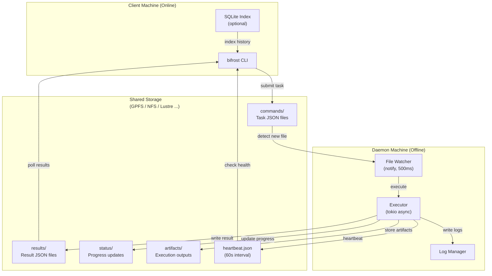
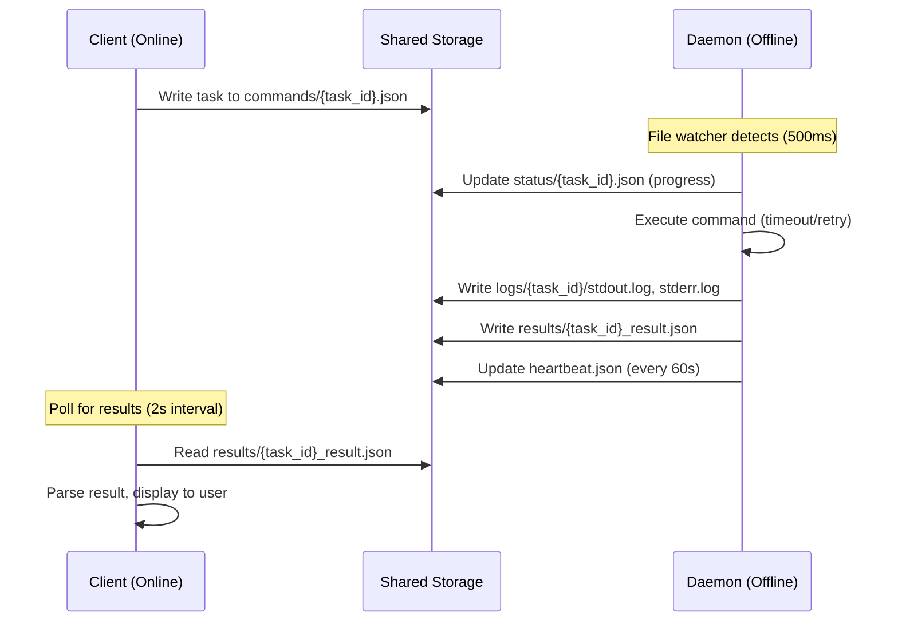

# Bifrost - Offline Machine Command Execution Framework

Bifrost is a Rust-based framework for executing commands on offline/air-gapped machines through shared storage communication. It enables networked client machines to submit tasks and offline daemon machines to execute them, with results synchronized via portable storage.

## 目录

- [Overview](#overview)
  - [Problem Solved](#problem-solved)
  - [Key Features](#key-features)
- [Architecture](#architecture)
- [Workflow](#workflow)
- [Directory Structure](#directory-structure)
- [Environment Requirements](#environment-requirements)
  - [Client Machine (Online)](#client-machine-online)
  - [Daemon Machine (Offline)](#daemon-machine-offline)
  - [Container Execution (Optional)](#container-execution-optional)
- [Installation](#installation)
  - [Build](#build)
  - [Deploy Client (Online Machine)](#deploy-client-online-machine)
  - [Deploy Daemon (Offline Machine)](#deploy-daemon-offline-machine)
- [Configuration](#configuration)
  - [Client Configuration](#client-configuration)
  - [Daemon Configuration](#daemon-configuration)
- [Usage](#usage)
  - [Submit Tasks](#submit-tasks)
  - [Check Status](#check-status)
  - [Retrieve Results](#retrieve-results)
  - [Read Artifacts](#read-artifacts)
  - [Health Check](#health-check)
  - [Daemon Operations](#daemon-operations)
- [Pytest Integration](#pytest-integration)
  - [Basic Usage](#basic-usage)
  - [Pytest in Container (Offline Machine)](#pytest-in-container-offline-machine)
  - [Pytest Prerequisites](#pytest-prerequisites-offline-machine)
- [Task Types](#task-types)
- [Task Priority](#task-priority)
- [Security Features](#security-features)
  - [Command Injection Prevention](#command-injection-prevention)
  - [Path Traversal Protection](#path-traversal-protection)
- [Development](#development)
  - [Running Tests](#running-tests)
  - [Project Structure](#project-structure)
- [Documentation](#documentation)
- [Troubleshooting](#troubleshooting)
- [License](#license)
- [Status](#status)

---

## Overview

### Problem Solved

When dealing with air-gapped machines (no network access), traditional remote execution tools like SSH, RPC, or REST APIs don't work. Bifrost solves this by using **shared storage as a communication channel**:

- **Client** (networked machine) writes tasks to `commands/` directory
- **Daemon** (offline machine) watches for new tasks and executes them
- **Results** are written back to `results/` directory
- Synchronization via GPFS shared storage

### Key Features

- **Task history with SQLite** - All tasks recorded for query
- **Structured pytest reports** - Store pytest JSON results
- **Unified settings** - ~/.bifrost/settings.json, init via CLI
- **Air-gapped operation** - Complete separation between client and daemon
- **Security hardened** - Command injection prevention, path traversal protection
- **High performance** - notify-based file watching (500ms latency), tokio async execution
- **Multiple task types** - Shell commands, pytest tests, custom adapters
- **Priority scheduling** - Tasks sorted by priority (0-255)
- **Timeout management** - Configurable timeouts with automatic retry
- **systemd integration** - Production-ready daemon deployment
- **Health monitoring** - Heartbeat-based daemon health checks

## Architecture



## Workflow



## Directory Structure

```
/shared/storage/
├── commands/              # Client writes, daemon reads
│   └── 20260704_103000_{uuid}.json
├── results/               # Daemon writes, client reads
│   └── {uuid}_result.json
├── status/                # Daemon writes progress updates
│   └── {uuid}.json
├── artifacts/             # Execution artifacts
│   └── {uuid}_report.json
├── logs/                  # Detailed execution logs
│   └── {uuid}/
│       ├── stdout.log
│       ├── stderr.log
│       └── metadata.json
└── heartbeat.json         # Daemon health status (60s update)
```

## 环境要求

### Ascend（联网机器，Client 端）

| 需求 | 版本 | 说明 |
|------|------|------|
| **Rust** | 1.70+ | 编译环境，只需编译一次 |
| **SQLite** | 3.x | 可选，任务历史索引 |
| **共享存储** | - | GPFS / NFS / Lustre 等 POSIX 共享文件系统，与 H20 共用 |

### H20（离线机器，Daemon 端）

| 需求 | 版本 | 说明 |
|------|------|------|
| **bifrost 二进制** | - | 单一二进制，零依赖 |
| **systemd** | - | 可选，推荐生产使用 |
| **共享存储** | - | 与 Ascend 挂载同一共享目录（GPFS / NFS / Lustre 等） |
| **Python** | 3.10+ | 可选，执行 pytest 任务时需要 |
| **pytest** | 7.x | 可选，执行 pytest 任务时需要 |
| **pytest-json-report** | - | Plugin for structured results |

### Container Execution (Optional)

通过容器在 H20 上执行 pytest：

```yaml
# adapters/docker_pytest.yaml
name: docker_pytest
description: Execute pytest in Docker container
command_template: "docker run --rm -v {working_dir}:/work python:3.10 pytest /work/{path} --json-report"
timeout: 600
artifacts:
  - report.json
env_vars:
  PYTEST_JSON_REPORT_FILE: "/work/report.json"
```

## Installation

### Build

编译环境需要 Rust 1.70+。如果没有 Rust 工具链，可以在任意有 Rust 的机器上编译，然后分发单一二进制文件（静态编译，无运行时依赖）。

```bash
# 克隆仓库
git clone http://10.20.30.25:8080/agent/bifrost.git
cd bifrost

# 编译 release 版本（约 8MB 单一二进制）
cargo build --release

# 确认编译产物
ls -lh target/release/bifrost
```

> **交叉编译：** 如果目标架构不同（如 x86_64 编译、aarch64 部署）：
> `cargo build --release --target aarch64-unknown-linux-gnu`

---

### 部署到 Ascend（联网机器，Client 端）

Ascend 机器负责下发命令和查询结果，只需要 CLI 二进制和配置文件。

```bash
# 1. 复制二进制
sudo cp target/release/bifrost /usr/local/bin/

# 2. 初始化配置（生成 ~/.bifrost/settings.json）
bifrost client init

# 3. 编辑配置，指定共享存储路径
vim ~/.bifrost/settings.json
```

```json
{
  "shared_storage": "/mnt/gpfs/bifrost",
  "database": "/mnt/gpfs/bifrost/bifrost.db",
  "client": {
    "poll_interval": "2s",
    "heartbeat_timeout": "180s"
  }
}
```

**验证 Client：**

```bash
# 查看帮助
bifrost client status --help

# 提交一个简单任务验证连通性（需 H20 daemon 已运行）
bifrost client submit --command "hostname" --task-type shell --timeout 30
# 记下返回的 TASK_ID
bifrost client status --task-id <TASK_ID>
bifrost client results --task-id <TASK_ID> --format text
```

---

### 部署到 H20（离线机器，Daemon 端）

H20 机器网络隔离，通过共享存储接收命令并返回结果。

两台机器挂载同一共享目录（当前使用 GPFS，也支持 NFS、Lustre 等 POSIX 文件系统），编译好的二进制可以直接被 H20 访问。

```bash
# ---- Ascend 端：编译后写入 GPFS 共享目录 ----
cp target/release/bifrost /mnt/gpfs/bifrost/bin/

# ---- H20 端：从共享存储安装 ----
# GPFS 已挂载在 /mnt/gpfs，直接访问
sudo cp /mnt/gpfs/bifrost/bin/bifrost /usr/local/bin/
sudo chmod +x /usr/local/bin/bifrost

# 初始化配置
mkdir -p ~/.bifrost
bifrost daemon --init
```

#### H20 配置 shared storage

```bash
vim ~/.bifrost/settings.json
```

```json
{
  "shared_storage": "/mnt/gpfs/bifrost",
  "daemon": {
    "poll_interval": "500ms",
    "task_timeout": "300s",
    "max_retries": 3,
    "heartbeat_interval": "60s",
    "max_concurrent": 10,
    "working_dir": "/tmp/bifrost/work"
  }
}
```

> **重要：** Ascend 和 H20 的 `shared_storage` 必须指向同一物理目录。

#### 注册 systemd 服务（推荐生产使用）

```bash
# 安装服务文件（项目根目录有 bifrost.service）
sudo cp bifrost.service /etc/systemd/system/
sudo systemctl daemon-reload
sudo systemctl enable bifrost
sudo systemctl start bifrost

# 查看状态
sudo systemctl status bifrost

# 查看实时日志
journalctl -u bifrost -f
```

#### 手动启动守护进程（调试用）

```bash
# 前台运行，按 Ctrl+C 停止
bifrost daemon

# 指定配置文件
bifrost daemon --config ~/.bifrost/settings.json

# 验证心跳文件已生成
ls -la /mnt/gpfs/bifrost/heartbeat.json
```

---

### 端到端验证部署

```bash
# H20 端：确认 daemon 运行且心跳正常
ls -la /mnt/gpfs/bifrost/heartbeat.json           # 文件应存在，60s 内更新
cat /mnt/gpfs/bifrost/heartbeat.json | head -5    # 显示 daemon 状态

# Ascend 端：端到端测试
bifrost client submit \
  --command "echo 'bifrost deployment ok' && nvidia-smi -L | head -3" \
  --task-type shell \
  --timeout 30

# 5-10 秒后拉取结果
bifrost client results --task-id <TASK_ID> --format text
# 预期输出包含 "bifrost deployment ok" 和 GPU 信息
```

## Configuration

### Settings File (`~/.bifrost/settings.json`)

```bash
bifrost client init    # generate default settings
bifrost daemon --init  # same file
```

```json
{
  "shared_storage": "/tmp/bifrost",
  "client": {},
  "daemon": {}
}
```

| Field | Client | Daemon | Description |
|-------|--------|--------|-------------|
| shared_storage | Yes | Yes | Root directory for commands/results/logs |
| database | Yes | -- | SQLite file for task history (client) |
| client.* | Yes | -- | Poll interval, heartbeat timeout |
| daemon.* | -- | Yes | Concurrency, timeout, retry, working dir |

## Usage

### Submit Tasks

```bash
# Shell command
bifrost client submit \
  --command "python script.py --input data.csv" \
  --task-type shell \
  --timeout 300 \
  --priority 10

# Pytest test
bifrost client pytest \
  --path tests/unit/ \
  --timeout 600 \
  --priority 5

# With working directory
bifrost client submit \
  --command "make build" \
  --task-type shell \
  --working-dir /workspace/project \
  --timeout 1200
```

### Check Status

```bash
# Query task status
bifrost client status --task-id <TASK_ID>

# Output
Task ID: abc123-def456
Status: Running
Progress: 45%
Elapsed: 120s
Estimated: 180s remaining
```

### Retrieve Results

```bash
# Get result in JSON format
bifrost client results --task-id <TASK_ID> --format json

# Get result in text format
bifrost client results --task-id <TASK_ID> --format text

# Output
Task ID: abc123-def456
Status: Completed
Duration: 45 seconds
Exit Code: 0

--- STDOUT ---
Test passed: 15
Test failed: 2

--- ARTIFACTS ---
report.json
coverage.xml
```

### Read Artifacts

```bash
# Get artifact path
bifrost client artifact --task-id <TASK_ID> --name report.json

# Read artifact content
bifrost client artifact --task-id <TASK_ID> --name report.json --read
```

### Health Check

```bash
# Check daemon health
bifrost client health

# Output
Daemon Status: Healthy
Last Heartbeat: 30s ago
Active Tasks: 2
Pending Tasks: 5
Completed Today: 15
```

### Query Task History

```bash
# List recent tasks
bifrost client history

# Filter by status
bifrost client history --status failed

# Filter by type
bifrost client history --type pytest

# Task detail
bifrost client history --task-id TASK_ID

# JSON output
bifrost client history --limit 50 --format json
```

### Daemon Operations

```bash
# Start daemon manually
bifrost daemon

# Check systemd service
sudo systemctl status bifrost

# View logs
journalctl -u bifrost -f
```

## Pytest Integration

### Basic Usage

Bifrost automatically builds pytest commands with JSON reporting:

```bash
# Submit pytest task
bifrost client pytest --path tests/ --timeout 600
```

Generated command:
```bash
pytest tests/ --json-report --json-report-file=report.json -v
```

### Pytest in Container (Offline Machine)

To run pytest in a container on the offline machine:

1. **Create Docker adapter**:
```yaml
# /etc/bifrost/adapters/docker_pytest.yaml
name: docker_pytest
command_template: "docker run --rm -v {working_dir}:/app -w /app python:3.10-slim pytest {path} --json-report --json-report-file=report.json"
timeout: 600
artifacts:
  - report.json
```

2. **Submit task with adapter**:
```bash
bifrost client submit \
  --command "tests/unit/" \
  --task-type pytest \
  --adapter docker_pytest \
  --working-dir /workspace/myproject
```

### Pytest Prerequisites (Offline Machine)

Install on offline machine or in container:

```bash
pip install pytest pytest-json-report pytest-cov
```

## Task Types

| Type | Description | Use Case |
|------|-------------|----------|
| `shell` | Shell command execution | Build scripts, data processing |
| `pytest` | Python test execution | Unit tests, integration tests |
| `custom` | Adapter-based execution | Docker, specialized tools |

## Task Priority

Priority ranges from 0 to 255:

| Range | Priority | Example |
|-------|----------|---------|
| 0-10 | High | Critical fixes, urgent tests |
| 11-50 | Normal | Regular tests, builds |
| 51-100 | Low | Background tasks, cleanup |
| 101-255 | Lowest | Maintenance, logs |

## Security Features

### Command Injection Prevention

Bifrost uses `shell-words::split()` to parse commands safely, avoiding shell interpolation:

```rust
// Safe: Direct process spawn without shell
let args = shell_words::split(&command)?;
Command::new(&args[0]).args(&args[1..]);
```

### Path Traversal Protection

Artifact paths are validated with canonicalization:

```rust
// Validate: no /, \, .., or null bytes
// Canonicalize: verify path is within artifacts directory
let canonical = artifact_path.canonicalize()?;
if !canonical.starts_with(&artifacts_dir) {
    return Err("Path traversal detected");
}
```

## Development

### Running Tests

```bash
# All tests
cargo test --all

# Unit tests only
cargo test --lib

# Integration tests
cargo test --test full_workflow_test

# Coverage (requires tarpaulin)
cargo tarpaulin --out Html
```

### Project Structure

```
bifrost/
├── src/
│   ├── core/           # Core models, protocol, and services
│   │   ├── models.rs   # Task, TaskResult, TaskStatus
│   │   ├── protocol.rs # File communication
│   │   ├── settings.rs # ~/.bifrost/settings.json
│   │   ├── db.rs       # SQLite history (tasks, artifacts, pytest)
│   │   ├── error.rs    # Error types
│   │   ├── lock.rs     # File locking
│   │   └── batch_tracker.rs
│   ├── client/         # Client submission and query
│   │   ├── submit.rs   # Task submission (file + SQLite)
│   │   ├── status.rs   # Status query
│   │   ├── results.rs  # Result retrieval
│   │   └── pytest.rs   # Pytest builder
│   ├── daemon/         # Daemon executor and watcher
│   │   ├── watcher.rs  # File event monitoring
│   │   ├── executor.rs # Command execution
│   │   ├── heartbeat.rs# Health monitoring
│   │   └── logger.rs   # Log management
│   └── main.rs         # CLI entry point
├── tests/
│   ├── unit/           # Unit tests
│   └── integration/    # Integration tests
├── config/             # Default configurations
├── scripts/            # Deployment scripts
└── docs/               # Documentation
```

## Documentation

- [Adapter Guide](docs/ADAPTER_GUIDE.md) - Custom task adapters
- [Deployment Guide](docs/DEPLOYMENT.md) - Production deployment
- [Architecture Guide](docs/ARCHITECTURE.md) - Technical architecture

## Troubleshooting

### Daemon Not Detecting Tasks

1. Check shared storage path permissions
2. Verify notify library works: `strace -e inotify_wait bifrost daemon`
3. Check commands/ directory exists

### Task Timeout

1. Increase timeout in task submission
2. Check system resources on daemon machine
3. Profile command execution time

### Heartbeat Timeout

1. Verify daemon process running: `systemctl status bifrost`
2. Check heartbeat.json permissions
3. Verify shared storage accessible

### Artifact Not Found

1. Verify command generates expected artifacts
2. Check working directory
3. Verify artifact_name doesn't contain path separators

## License

MIT License - see [LICENSE](LICENSE) file.

## Status

Bifrost v0.1.0 is released. Core functionality is stable and tested. Future enhancements:

- Web UI monitoring dashboard
- Distributed execution (multiple daemons)
- Task dependency graph (DAG scheduling)
- AI-based task scheduling optimization