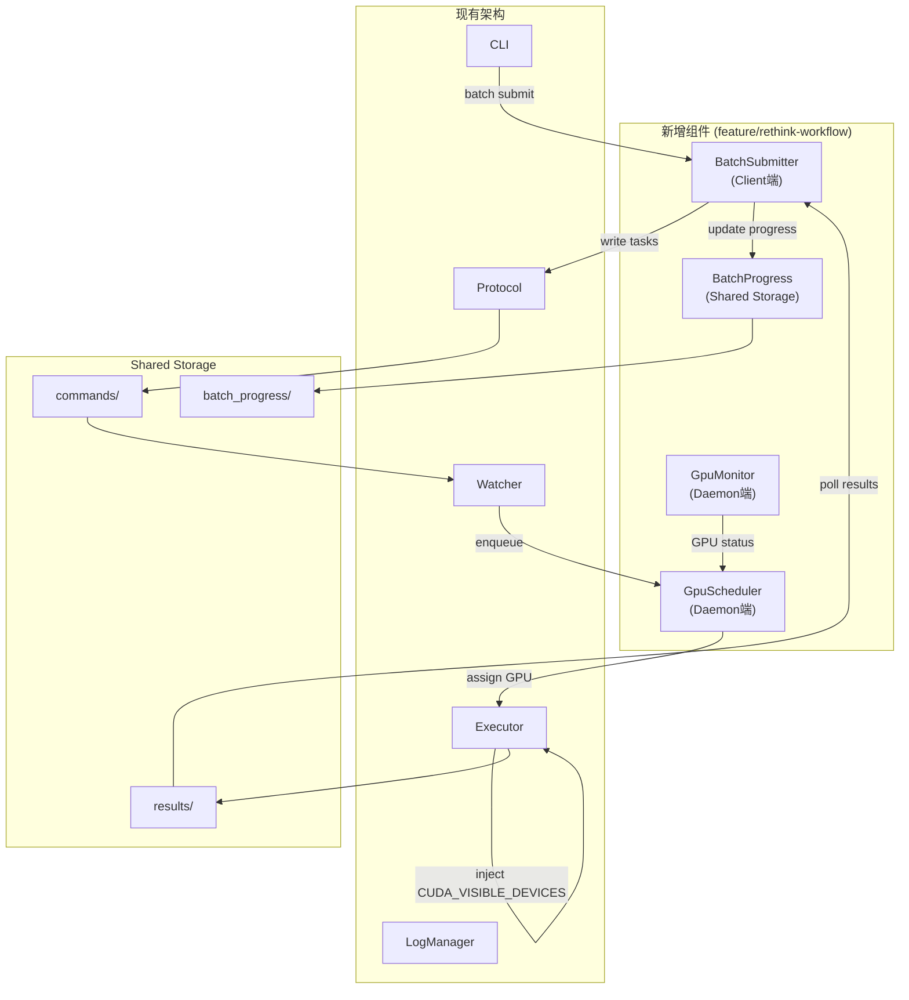
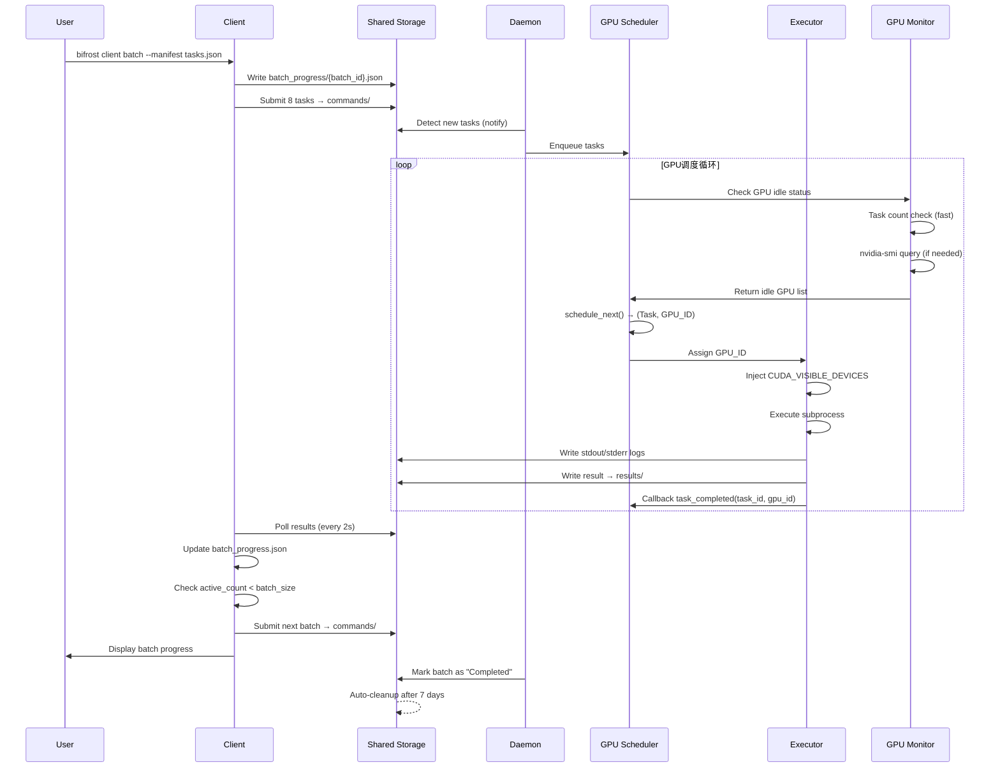
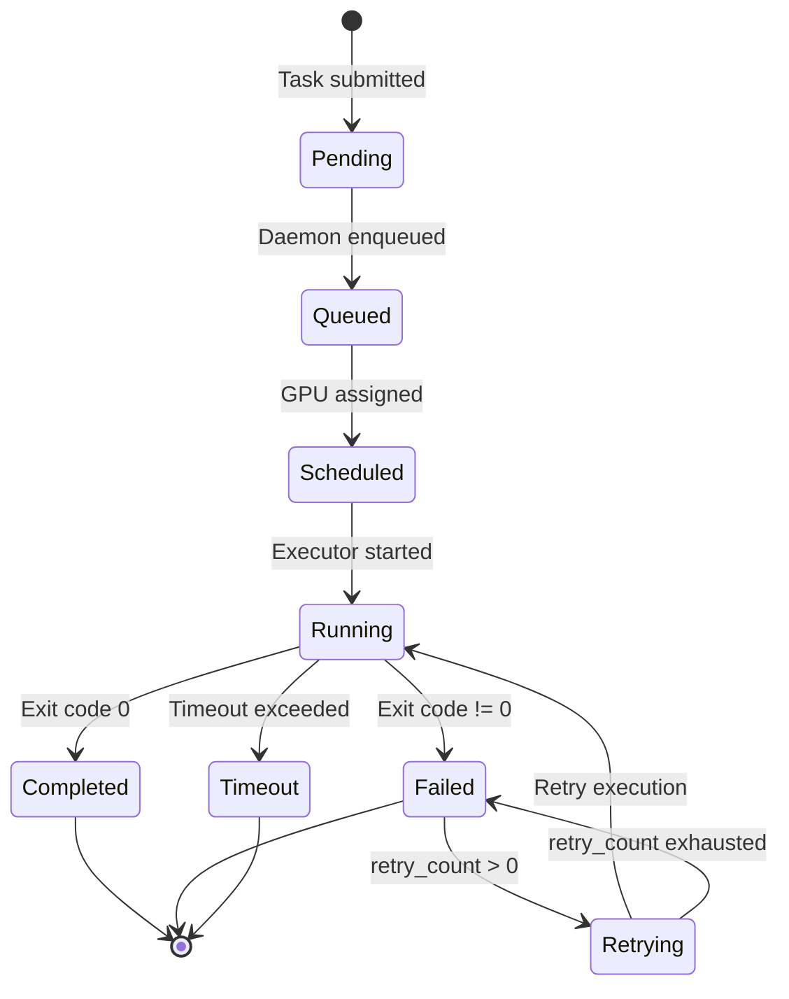
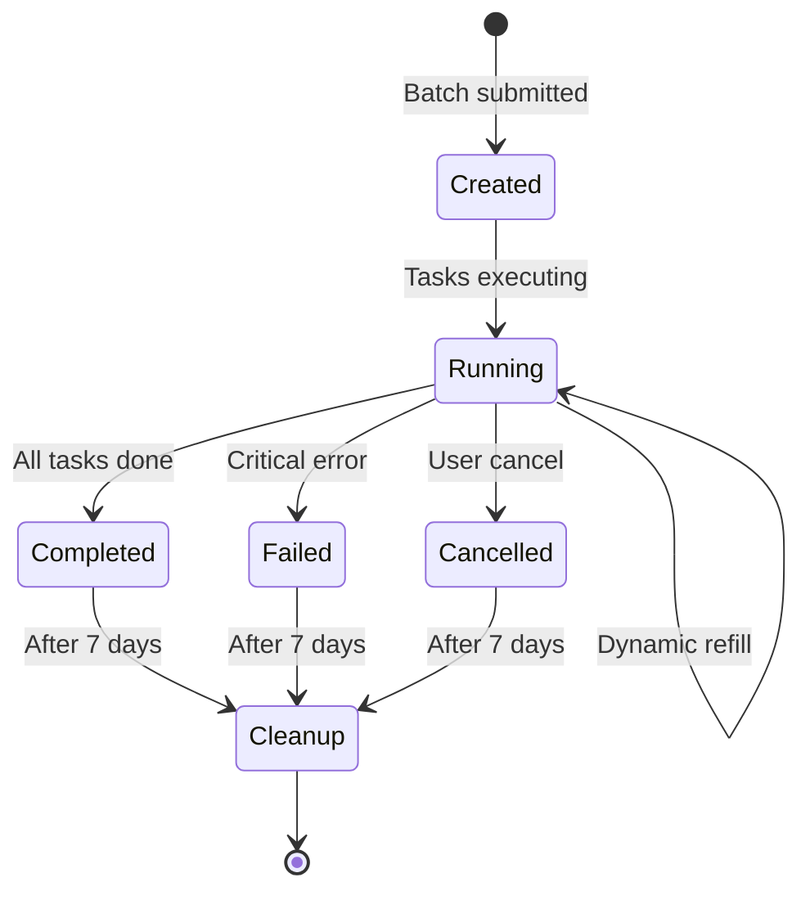
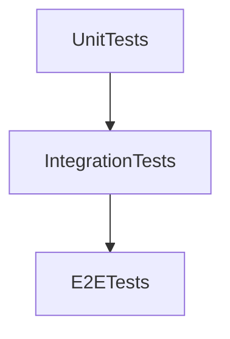

# Batch GPU Scheduling Design

**Date**: 2026-07-06
**Author**: Claude + User
**Status**: Approved
**Branch**: feature/rethink-workflow

---

## Executive Summary

Enable batch task submission with automatic GPU resource scheduling for parallel pytest execution on offline machines with multiple GPUs (e.g., 8 GPU cards).

**Problem**: Current architecture only supports single-task submission, no GPU resource scheduling, no batch processing capability.

**Solution**: Add GPU resource pool scheduler, batch submitter with progress tracking, and elastic queue refill mechanism.

---

## Section 1: Architecture Overview

### 1.1 System Architecture

Based on existing bifrost framework, add following components:



### 1.2 File Structure Extension

新增文件：
```
bifrost/
├── src/
│   ├── client/
│   │   ├── batch.rs          # 新增：批量提交器
│   │   ├── submit.rs         # 现有：单任务提交（保留）
│   │   └── progress.rs       # 新增：进度追踪
│   ├── daemon/
│   │   ├── gpu_scheduler.rs  # 新增：GPU资源池
│   │   ├── gpu_monitor.rs    # 新增：GPU监控
│   │   ├── executor.rs       # 现有：需扩展GPU注入
│   │   └── watcher.rs        # 现有：需扩展调度逻辑
│   └── core/
│       ├── models.rs         # 现有：扩展BatchProgress模型
│       └── batch_tracker.rs  # 新增：Batch进度管理
```

---

## Section 2: Client端设计

### 2.1 Task Manifest Format (JSON)

**From tests.txt to tasks.json**:

```json
{
  "batch_name": "GPU并发推理测试",
  "description": "在8张GPU上并发执行推理测试",
  "tasks": [
    {
      "task_name": "test_inference_gpu0",
      "description": "在GPU0上测试推理性能",
      "command": "pytest tests/test_inference.py::test_case1 -v",
      "task_type": "pytest",
      "timeout": 600,
      "priority": 10,
      "working_dir": "/workspace/project",
      "env_vars": {
        "MODEL_PATH": "/models/bert-base"
      },
      "artifacts_expected": ["report.json"],
      "metadata": {
        "test_category": "performance",
        "expected_duration": "5m"
      }
    }
  ]
}
```

### 2.2 BatchSubmitter Component

**Core responsibilities**:
- Read tasks.json file
- Submit tasks in batches
- Poll results and dynamic refill
- Maintain progress JSON file

**Data structure**:
```rust
pub struct BatchSubmitter {
    file_path: PathBuf,
    batch_size: usize,
    progress: BatchProgress,
    protocol: Protocol,
    poll_interval: Duration,
}

impl BatchSubmitter {
    pub fn new(file_path: PathBuf, batch_size: usize, shared_storage: PathBuf) -> Result<Self>;
    pub fn submit_next_batch(&mut self, count: usize) -> Result<Vec<(String, Uuid)>>;
    pub fn poll_results(&mut self) -> Result<Vec<TaskResult>>;
    pub fn maintain_batch(&mut self) -> Result<Vec<Uuid>>;
    pub fn get_progress(&self) -> BatchStats;
}
```

### 2.3 BatchProgress Data Model

**Progress file location**: `shared_storage/batch_progress/{batch_id}.json`

```rust
#[derive(Serialize, Deserialize)]
pub struct BatchProgress {
    pub batch_id: Uuid,
    pub manifest_path: PathBuf,
    pub total_tasks: usize,
    pub current_index: usize,
    pub submitted_tasks: Vec<(usize, Uuid, String)>,  // (index, task_id, task_name)
    pub completed_tasks: Vec<(Uuid, TaskStatus, String)>,
    pub status: BatchStatus,
    pub created_at: DateTime<Utc>,
    pub updated_at: DateTime<Utc>,
}

pub enum BatchStatus {
    Submitting,
    Running,
    Completed,
    Failed,
}
```

### 2.4 Dynamic Refill Logic

**Core algorithm**:
```rust
pub fn maintain_batch(&mut self) -> Result<Vec<Uuid>> {
    // 1. Poll results of submitted tasks
    let new_results = self.poll_results()?;
    
    // 2. Update completed_tasks list
    for result in new_results {
        self.progress.completed_tasks.push((result.task_id, result.status, result.task_name));
        self.progress.updated_at = Utc::now();
    }
    
    // 3. Calculate active task count
    let active_count = self.progress.submitted_tasks.len() 
                     - self.progress.completed_tasks.len();
    
    // 4. Elastic refill: if active < batch_size, submit new tasks
    if active_count < self.batch_size {
        let slots_available = self.batch_size - active_count;
        let new_tasks = self.submit_next_batch(slots_available)?;
        return Ok(new_tasks);
    }
    
    Ok(Vec::new())
}
```

### 2.5 CLI Commands

```bash
# Batch submission
bifrost client batch --manifest tasks.json --batch-size 8

# Query progress
bifrost client batch-status --batch-id <BATCH_ID>

# List active batches
bifrost client batch-list

# Cleanup completed batch
bifrost client batch-cleanup --batch-id <BATCH_ID>
```

---

## Section 3: Daemon端设计

### 3.1 GpuScheduler Component

**Core responsibilities**:
- Maintain GPU resource pool status
- Task queue management (pending_queue)
- GPU allocation algorithm (elastic scheduling)
- Integration with Executor

**Data structure**:
```rust
pub struct GpuScheduler {
    gpu_pool: Vec<u32>,  // [0, 1, 2, 3, 4, 5, 6, 7]
    active_tasks: HashMap<u32, Vec<Uuid>>,
    pending_queue: VecDeque<Task>,
    monitor: GpuMonitor,
    max_concurrent: usize,
}

impl GpuScheduler {
    pub fn new(gpu_pool: Vec<u32>) -> Result<Self>;
    pub fn enqueue(&mut self, task: Task);
    pub fn schedule_next(&mut self) -> Option<(Task, u32)>;
    pub fn task_completed(&mut self, task_id: Uuid, gpu_id: u32);
    pub fn get_status(&self) -> SchedulerStatus;
}
```

### 3.2 GPU Scheduling Algorithm

**Elastic scheduling strategy**:
```rust
pub fn schedule_next(&mut self) -> Option<(Task, u32)> {
    // 1. Check pending tasks
    if self.pending_queue.is_empty() {
        return None;
    }
    
    // 2. Find idle GPU (hybrid verification)
    let idle_gpu = self.find_idle_gpu();
    
    // 3. Assign task to idle GPU
    if let Some(gpu_id) = idle_gpu {
        let task = self.pending_queue.pop_front().unwrap();
        self.active_tasks.entry(gpu_id).or_insert_with(Vec::new).push(task.task_id);
        return Some((task, gpu_id));
    }
    
    None
}

fn find_idle_gpu(&self) -> Option<u32> {
    for gpu_id in &self.gpu_pool {
        // First layer: task count check (fast)
        let task_count = self.active_tasks.get(gpu_id).map(|v| v.len()).unwrap_or(0);
        
        if task_count == 0 {
            // Second layer: nvidia-smi verification (accurate)
            if self.monitor.is_gpu_idle(*gpu_id) {
                return Some(*gpu_id);
            }
        }
    }
    None
}
```

### 3.3 GpuMonitor Component

**Hybrid monitoring strategy**:
- **Fast check**: Task count (memory state, 0 latency)
- **Accurate verification**: nvidia-smi (5s interval, precise status)

```rust
pub struct GpuMonitor {
    gpu_pool: Vec<u32>,
    check_interval: Duration,  // 5s
    last_check: HashMap<u32, DateTime<Utc>>,
    utilization_cache: HashMap<u32, f32>,
}

impl GpuMonitor {
    pub fn is_gpu_idle(&self, gpu_id: u32) -> bool {
        let should_check_smi = self.should_check_smi(gpu_id);
        
        if should_check_smi {
            let util = self.query_gpu_utilization(gpu_id);
            return util < 5.0;  // Idle definition: utilization < 5%
        }
        
        let cached = self.utilization_cache.get(&gpu_id).unwrap_or(&0.0);
        *cached < 5.0
    }
    
    fn query_gpu_utilization(&self, gpu_id: u32) -> f32 {
        Command::new("nvidia-smi")
            .args(["--query-gpu", "utilization.gpu", "--format=csv,noheader,nounits", "-i", &gpu_id.to_string()])
            .output()
    }
}
```

### 3.4 Executor Extension - GPU Environment Injection

```rust
pub struct Executor {
    log_manager: LogManager,
    default_timeout: Duration,
    assigned_gpu: Option<u32>,
}

impl Executor {
    pub async fn execute_with_gpu(&self, task: &Task, gpu_id: u32) -> Result<TaskResult> {
        // 1. Inject CUDA_VISIBLE_DEVICES environment variable
        let mut task_with_gpu = task.clone();
        task_with_gpu.env_vars.insert(
            "CUDA_VISIBLE_DEVICES".to_string(),
            gpu_id.to_string(),
        );
        
        // 2. Execute task (original logic)
        self.execute(&task_with_gpu).await
    }
}
```

**GPU remapping**:
```rust
// Physical GPU 5 execution
task.env_vars.insert("CUDA_VISIBLE_DEVICES", "5");

// Inside pytest process:
// torch.cuda.current_device() == 0 (remapped to 0)
// Actually maps to physical GPU 5
```

### 3.5 Watcher Extension - Scheduler Integration

```rust
pub struct Watcher {
    protocol: Protocol,
    executor: Executor,
    scheduler: GpuScheduler,
}

impl Watcher {
    pub async fn run(&mut self) -> Result<()> {
        loop {
            // 1. Detect new tasks
            if let Some(new_task) = self.detect_new_task()? {
                self.scheduler.enqueue(new_task);
            }
            
            // 2. Schedule tasks
            while let Some((task, gpu_id)) = self.scheduler.schedule_next() {
                let executor = self.executor.clone();
                tokio::spawn(async move {
                    let result = executor.execute_with_gpu(&task, gpu_id).await;
                    // Write result...
                    // Callback: task_completed(task_id, gpu_id)
                });
            }
            
            // 3. Cleanup completed tasks
            self.check_completed_tasks()?;
            
            tokio::time::sleep(Duration::from_millis(500)).await;
        }
    }
}
```

---

## Section 4: Data Flow & Error Handling

### 4.1 Complete Data Flow



### 4.2 Task Status Machine



### 4.3 Error Scenario Handling

**Scenario 1: nvidia-smi failure**
- Fallback to task count check
- Return 0.0 (assume idle) on failure
- Log warning message

**Scenario 2: Executor process crash**
- Task marked as Failed
- GPU resource released via callback
- BatchSubmitter records failure
- Continue other tasks

**Scenario 3: Batch cancel**
- Update progress status to "Cancelled"
- Stop submitting new tasks
- Already submitted tasks continue execution

**Scenario 4: Client restart**
- Read progress file
- Resume from current_index
- Continue polling submitted tasks

**Scenario 5: Daemon restart**
- Scan commands/ directory
- Re-enqueue pending tasks
- Rebuild active_tasks mapping if needed

**Scenario 6: Task timeout**
- Executor timeout mechanism (existing)
- GPU resource released
- BatchSubmitter records timeout status
- No blocking of other tasks

### 4.4 Progress File Lifecycle



**Cleanup mechanism**:
```rust
pub fn cleanup_old_batches(shared_storage: PathBuf) {
    let batch_dir = shared_storage.join("batch_progress");
    
    for file in fs::read_dir(batch_dir)? {
        let progress: BatchProgress = read_json(file.path())?;
        let age = Utc::now() - progress.updated_at;
        
        if age > Duration::days(7) && 
           progress.status in [Completed, Failed, Cancelled] {
            fs::remove_file(file.path())?;
        }
    }
}
```

---

## Section 5: Deployment & Debugging

### 5.1 Deployment Scenarios

| Scenario | Method | Features | Environment |
|----------|--------|----------|-------------|
| **Development** | Manual run | Flexible, real-time logs, interruptible | Dev machine |
| **Testing** | systemd one-shot | One-time test, view logs | Test environment |
| **Production** | systemd service | Auto-restart, long-running | Offline machine |

### 5.2 Development Debugging Mode

**Manual run** (recommended for development):
```bash
# Direct run (simplest)
bifrost daemon --config config/daemon.yaml --log-level debug --shared-storage ./test_shared_storage

# With GPU debug output
bifrost daemon --config config/daemon.yaml --log-level debug --gpu-debug

# Simulate mode (no real GPU)
bifrost daemon --config config/daemon.yaml --simulate-gpu 8
```

### 5.3 Debug Helper Features

**New CLI parameters**:
```rust
struct DaemonArgs {
    #[arg(short, long)]
    config: PathBuf,
    
    #[arg(long, default_value = "info")]
    log_level: String,
    
    #[arg(long)]
    gpu_debug: bool,
    
    #[arg(long)]
    simulate_gpu: Option<usize>,
    
    #[arg(long)]
    one_shot: bool,
    
    #[arg(long)]
    shared_storage: Option<PathBuf>,
}
```

**Simulate GPU mode**:
```rust
pub struct GpuMonitor {
    simulate_mode: bool,
}

impl GpuMonitor {
    pub fn is_gpu_idle(&self, gpu_id: u32) -> bool {
        if self.simulate_mode {
            return true;  // Always idle in simulate mode
        }
        // Real mode: call nvidia-smi
    }
}
```

### 5.4 systemd Debugging

**View real-time logs**:
```bash
journalctl -u bifrost -f              # Real-time
journalctl -u bifrost -n 100          # Last 100 lines
journalctl -u bifrost --since today   # Today's logs
journalctl -u bifrost -p err          # Error logs only
```

### 5.5 Production Deployment Flow

```bash
# Step 1: Build release
cargo build --release

# Step 2: Install binary
sudo cp target/release/bifrost /usr/local/bin/

# Step 3: Install health check script
sudo cp scripts/bifrost-health-check.sh /usr/local/bin/

# Step 4: Create config
sudo mkdir -p /etc/bifrost
sudo cp config/daemon.yaml /etc/bifrost/

# Step 5: Edit config (set GPU pool)
sudo vim /etc/bifrost/daemon.yaml

# Step 6: Install systemd service
sudo cp bifrost.service /etc/systemd/system/
sudo mkdir -p /shared/storage/{commands,results,batch_progress,logs,status}
sudo systemctl daemon-reload
sudo systemctl start bifrost
sudo systemctl enable bifrost
```

### 5.6 systemd Enhancement (Option A)

```ini
[Service]
Restart=on-failure
RestartSec=10

# New: restart strategy
StartLimitIntervalSec=60
StartLimitBurst=5

# New: heartbeat detection
ExecStartPost=/usr/local/bin/bifrost-health-check.sh startup
ExecCondition=/usr/local/bin/bifrost-health-check.sh heartbeat

# New: GPU validation
ExecStartPre=/usr/local/bin/bifrost-gpu-check.sh
```

**Health check script**:
```bash
#!/bin/bash
case "$1" in
    heartbeat)
        HEARTBEAT_FILE="/var/lib/bifrost/heartbeat.json"
        LAST_BEAT=$(jq -r '.timestamp' "$HEARTBEAT_FILE")
        AGE=$(( $(date +%s) - $(date -d "$LAST_BEAT" +%s) ))
        
        if [ $AGE -gt 180 ]; then
            echo "Heartbeat stale: $AGE seconds"
            exit 1
        fi
        exit 0
        ;;
esac
```

### 5.7 Status Monitoring Commands

**Daemon status**:
```bash
bifrost daemon status

# Output:
{
  "daemon_status": "Running",
  "gpu_pool": [0, 1, 2, 3, 4, 5, 6, 7],
  "active_gpus": 5,
  "idle_gpus": 3,
  "pending_tasks": 12,
  "active_tasks": [...],
  "completed_today": 45
}
```

**Batch progress**:
```bash
bifrost client batch-list

# Output:
[
  {
    "batch_id": "uuid-1",
    "batch_name": "GPU并发推理测试",
    "status": "Running",
    "submitted": 24,
    "completed": 16,
    "active": 8
  }
]
```

---

## Section 6: Testing Strategy

### 6.1 Test Layer Architecture



### 6.2 Unit Tests

**Test 1: GpuScheduler scheduling logic**
- Test schedule_next_with_idle_gpu
- Test task_completed_releases_gpu
- Test elastic_queue_refill

**Test 2: GpuMonitor simulate mode**
- Test simulate_mode_always_idle
- Test real_mode_with_nvidia_smi (only on real GPU)

**Test 3: BatchSubmitter submit logic**
- Test submit_next_batch
- Test progress_file_persistence
- Test dynamic_refill

**Test 4: TaskManifest parsing**
- Test parse_task_manifest

### 6.3 Integration Tests

**Test 1: Full batch workflow**
- Submit batch → Execute → Dynamic refill → Complete

**Test 2: GPU allocation and release**
- Submit超额tasks → Verify GPU allocation → Verify release

**Test 3: Error recovery**
- Client restart recovery
- Daemon restart recovery

### 6.4 E2E Tests

**Test 1: Real pytest execution** (requires GPU)
- Execute real pytest on GPU
- Verify CUDA_VISIBLE_DEVICES injection
- Verify GPU isolation

**Test 2: systemd deployment validation**
- Build and install
- Start service
- Check heartbeat
- Test task execution
- Cleanup

### 6.5 Mock & Test Helpers

**Mock GPU environment**:
```rust
pub struct MockGpuEnvironment {
    simulate_mode: bool,
}

impl MockGpuEnvironment {
    pub fn create_fake_tasks(count: usize) -> TaskManifest;
}
```

**Test fixtures**:
```rust
pub struct TestEnv {
    pub shared_storage: TempDir,
    pub daemon: MockDaemon,
    pub submitter: BatchSubmitter,
}
```

### 6.6 Coverage Targets

| Module | Target | Key Points |
|--------|--------|-----------|
| GpuScheduler | 90%+ | Scheduling, GPU release, elastic queue |
| GpuMonitor | 80%+ | nvidia-smi call, simulate mode |
| BatchSubmitter | 90%+ | Batch submit, progress tracking, dynamic refill |
| TaskManifest | 95%+ | JSON parse, field validation |
| BatchProgress | 90%+ | File read/write, status update |
| Integration | 70%+ | Full flow, error recovery |
| E2E | Manual | Real pytest, systemd deploy |

---

## Key Technical Decisions

1. **GPU Scheduling**: Hybrid verification (task count + nvidia-smi)
2. **Elastic Queue**: Over-submission mode, dynamic refill to keep GPU fully utilized
3. **GPU Isolation**: Process-level injection + remapping mode
4. **Progress Tracking**: JSON file storage (temporary) + SQLite (long-term history)
5. **Lifecycle**: systemd management + auto cleanup after 7 days

---

## Extension Considerations

**Future extensions**:
- Multi-Daemon coordination (cross-machine GPU pool)
- Web UI monitoring panel
- AI scheduling optimization (based on historical data)
- Task dependency graph (DAG scheduling)

---

## Implementation Priority

1. **Phase 1**: Core framework - GpuScheduler, GpuMonitor, BatchSubmitter
2. **Phase 2**: Integration - systemd enhancement, health check
3. **Phase 3**: Testing - unit tests, integration tests
4. **Phase 4**: Documentation & deployment guide

---

## Approval

- **Date**: 2026-07-06
- **User**: Approved all sections
- **Next Step**: Invoke writing-plans skill for implementation plan